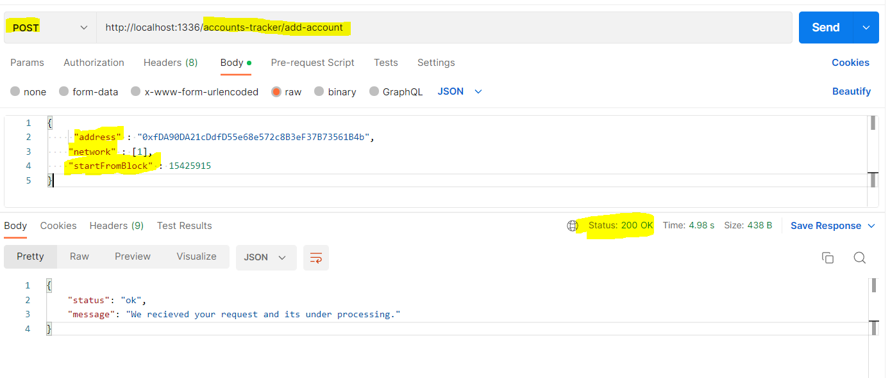
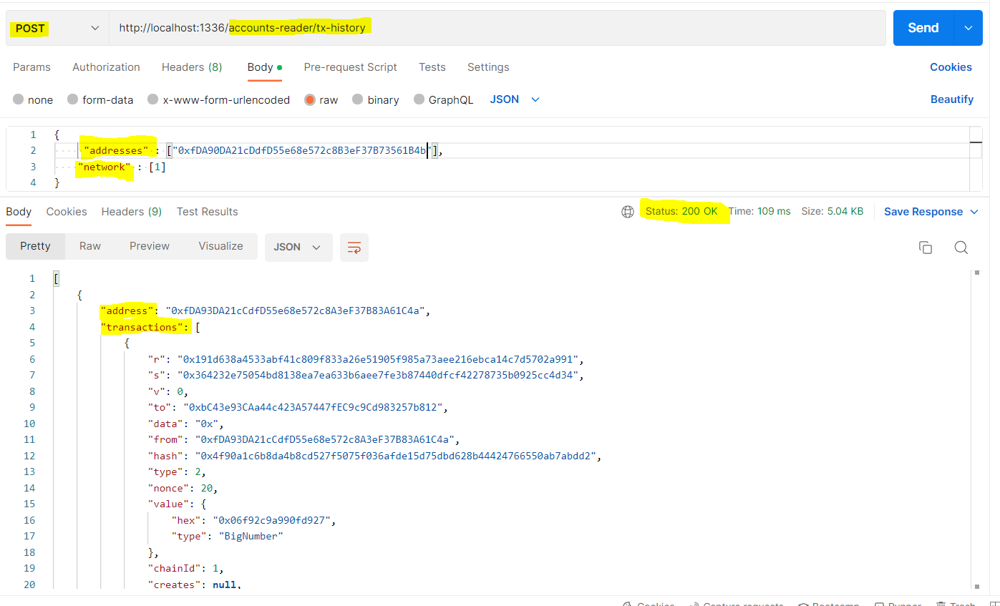
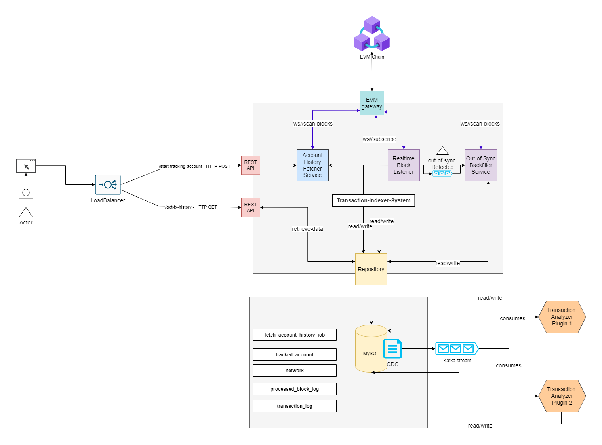
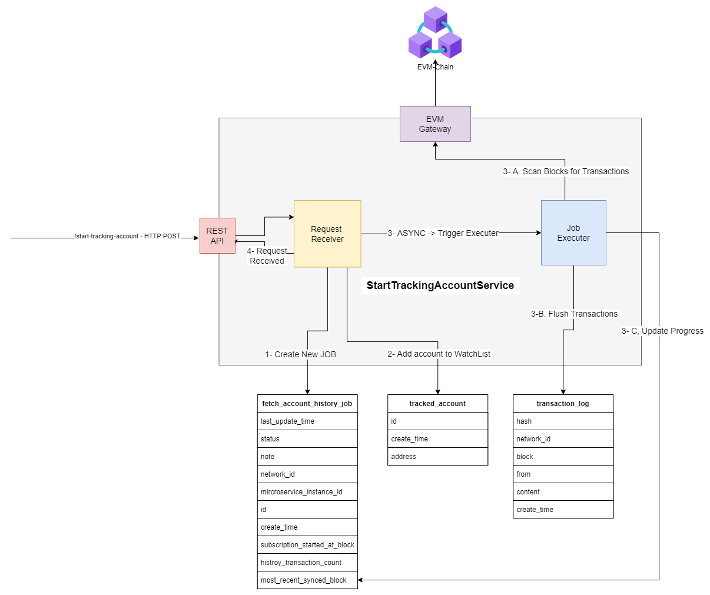
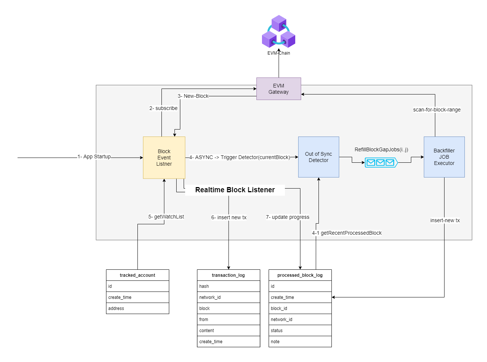

# Project : transction-indexer  
   
# Steps to run the project : 
### 1- ```git clone https://github.com/mounzer-masri/transction-indexer.git```  
### 2- ```npm install```   
### 3- run the server ```npx ts-node src/server.ts```
### 5- From Postman call this API to add account to tracking-list :  
Method : /POST  
```http://localhost:1336/accounts-tracker/add-account```   
   

### 6-From Postman call this API to add account to get-history :    
Method : /POST  
```http://localhost:1336/accounts-reader/tx-history```   
  
 
   
   
# System Design HLD : 

   

   
      
# StartTrackingAccount Component : 
  
    
    
    
# LiveBlockListner & OutOfSyncDetector Component : 
  
 
